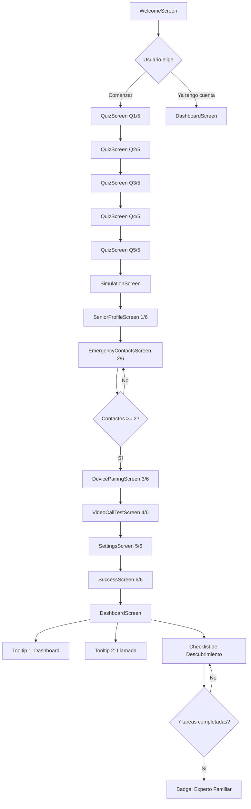

# Flujo de Onboarding FamilyBridge - Diseño Completo

**Fecha:** 27 de octubre de 2024
**Versión:** 1.0
**Autor:** Especificación TAREA 2 - Onboarding Implementation

---

## 1. VISIÓN GENERAL DEL ONBOARDING

### 1.1 Objetivos del Onboarding

El onboarding de FamilyBridge tiene objetivos múltiples que se cumplen en 5 etapas progresivas:

**Objetivo Principal:**
Facilitar que un familiar configure completamente la app en **12-15 minutos** y comprenda el valor que la aplicación le dará.

**Objetivos por Etapa:**

1. **Etapa 1 (Llegada y Segmentación)**: Personalizar la experiencia basándose en las necesidades reales del usuario
2. **Etapa 2 (Demostración de Valor)**: Mostrar el valor tangible antes de pedir mucho esfuerzo
3. **Etapa 3 (Configuración Guiada)**: Configurar paso a paso las funcionalidades críticas de forma guiada
4. **Etapa 4 (Primera Interacción)**: Validar que todo funciona correctamente con una interacción real simulada
5. **Etapa 5 (Onboarding Progresivo)**: Educar gradualmente sin saturar, justo cuando el usuario necesita información

### 1.2 Métricas de Éxito

| Métrica | Objetivo | Medición |
|---------|----------|----------|
| **Tasa de completación** | >85% | Usuarios que completan todo el onboarding |
| **Tiempo promedio** | 12-15 min | Tiempo desde welcome hasta success screen |
| **Satisfacción post-onboarding** | >8/10 | Score de satisfacción inmediata |
| **Tasa de conversión a uso activo** | >70% | Usuarios que usan la app dentro de 24h |
| **Menos de 3 abandonos** | Por cada 10 usuarios | Puntos de fricción identificados |

### 1.3 Principios de Diseño

Basados en **apps premiadas** (Canva, Duolingo, Slack):

1. **Valor Inmediato**: Mostrar beneficios antes de pedir información
2. **Progressive Disclosure**: Revelar información gradualmente conociente
3. **Gamificación Sutíl**: Logros y celebración sin saturar
4. **Feedback Constante**: El usuario siempre sabe dónde está y qué falta
5. **Reversibilidad**: Puede volver atrás y editar sin pérdida de datos
6. **Offline First**: Todo funciona sin conexión (datos mock)
7. **Personalización**: Experiencia adaptada a las respuestas del quiz

---

## 2. ARQUITECTURA DEL FLUJO (5 ETAPAS)

### 2.1 ETAPA 1: Llegada y Segmentación (60-120 segundos)

#### **Pantallas Involucradas:**
- ✅ `WelcomeScreen` (ya implementada)
- 📍 `QuizScreen` (TAREA 3)

#### **Flujo Detallado:**

**1.1 Bienvenida (WelcomeScreen)**
```
Usuario abre la app
↓
Ve pantalla de bienvenida con:
  - Logo de FamilyBridge
  - Mensaje emocional: "Conecta con quien más quieres"
  - Descripción breve del valor
  - Botón "Comenzar configuración"
  - Link "Ya tengo cuenta"
↓
Si pulsa "Comenzar" → Navigate to QuizScreen
Si pulsa "Ya tengo cuenta" → Navigate to DashboardScreen (mock login)
```

**1.2 Quiz de Personalización (QuizScreen)**
```
Pregunta 1/5: ¿Cuál es tu relación con la persona mayor?
  Opciones:
  - 👨‍👩‍👧‍👦 Hijo/a
  - 👴‍👵 Nieto/a  
  - 🤝 Cuidador/a
  - 👤 Otro

Usuario selecciona → Feedback visual → Botón "Siguiente" activado
↓
[Animación de transición]
↓
Pregunta 2/5: ¿Qué te preocupa más?
  Opciones:
  - 📞 Comunicación
  - 🚨 Emergencias
  - 💊 Medicación
  - 💙 Soledad

Usuario selecciona → Feedback visual → Botón "Siguiente" activado
↓
[Animación de transición]
↓
Pregunta 3/5: ¿Nivel tecnológico del senior?
  Opciones:
  - 📱 Ninguno
  - 📲 Básico
  - 💻 Intermedio

Usuario selecciona → Feedback visual → Botón "Siguiente" activado
↓
[Animación de transición]
↓
Pregunta 4/5: ¿Dónde vive tu familiar?
  Opciones:
  - 🏠 Mismo hogar
  - 🏘️ Cerca
  - 🌍 Lejos
  - 🏥 Residencia

Usuario selecciona → Feedback visual → Botón "Siguiente" activado
↓
[Animación de transición]
↓
Pregunta 5/5: ¿Cuántos familiares participarán?
  Opciones:
  - 👤 Solo yo
  - 👥 2-3 personas
  - 👨‍👩‍👧‍👦 Familia extendida

Usuario selecciona → Botón "Continuar" activado
↓
Guardar respuestas en Context + AsyncStorage
↓
Navigate to SimulationScreen
```

#### **Características de la UI:**

**Elementos Visuales:**
- Header con barra de progreso: `1/5 (20%)`, `2/5 (40%)`, etc.
- Logo pequeño de FamilyBridge
- Botón "Atrás" (vuelve a pregunta anterior)
- Título de la pregunta en tipografía grande (24px+)
- Grid de opciones con iconos grandes (48px) + texto
- Animación de opción seleccionada: scale(1.1) + borde azul
- Botón "Siguiente" deshabilitado hasta selección
- Feedback al seleccionar: vibración sutil (opcional)

**Transiciones:**
- Slide from right al avanzar (300ms)
- Slide from left al retroceder (300ms)
- Ease-out animation

**Validaciones:**
- No se puede avanzar sin seleccionar opción
- Visual feedback inmediato al seleccionar

#### **Datos Capturados:**

```javascript
{
  quizAnswers: {
    relacion: string,           // 'hijo' | 'nieto' | 'cuidador' | 'otro'
    preocupacion: string,       // 'comunicacion' | 'emergencias' | 'medicacion' | 'soledad'
    nivelTech: string,          // 'ninguno' | 'basico' | 'intermedio'
    ubicacion: string,          // 'mismo_hogar' | 'cerca' | 'lejos' | 'residencia'
    cantidadFamiliares: string  // 'solo_yo' | '2_3' | 'familia_extendida'
  },
  fechaCompletado: timestamp,
  tiempoTotal: number // segundos
}
```

**Persistencia:**
- Guardar en `OnboardingContext` inmediatamente
- Sync con `AsyncStorage` al completar cada pregunta
- Si app se cierra, al volver mostrar última pregunta incompleta

---

### 2.2 ETAPA 2: Demostración de Valor (60-120 segundos)

#### **Pantalla:**
- 📍 `SimulationScreen` (TAREA 4)

#### **Flujo Detallado:**

```
Usuario llega desde QuizScreen
↓
Muestra dashboard simulado (réplica de control_center_home_dashboard)
↓
Texto: "Así funciona FamilyBridge"
↓
Después de 2 segundos
↓
Notificación 1 aparece con fade-in (3 seg de duración):
  📸 "Tu [relacion del quiz] te envió una foto"
  Desc: "Foto del jardín saya lo pejor"
  Imagen: Placeholder de jardín
↓
Usuario puede tocar la notificación → Modal con imagen expandida
↓
Después de 3 segundos más
↓
Notificación 2 aparece:
  ✅ "Check-in diario completado"
  Desc: "[Nombre mock senior] está bien"
  Icono: Check verde con animación
↓
Usuario puede tocar → Modal con detalles del check-in
↓
Después de 3 segundos más
↓
Notificación 3 aparece:
  💊 "Recordatorio de medicación"
  Desc: "Próxima dosis en 30 minutos"
  Icono: Píldora animada
↓
Usuario puede tocar → Modal con detalles de medicación
↓
Botón "Continuar configuración" siempre visible
↓
Al pulsar → Navigate to SeniorProfileScreen
```

#### **Personalización Basada en Quiz:**

**Si `preocupacion == 'emergencias'`:**
- Enfatizar notificación de emergencias (si se agrega una 4ta)
- Colores más intensos en alertas

**Si `preocupacion == 'medicacion'`:**
- La notificación 3 ocupa más espacio
- Mostrar lista de medicamentos en el modal

**Si `preocupacion == 'soledad'`:**
- Enfatizar check-in y comunicación
- Mensajes más cálidos

**Si `nivelTech == 'ninguno'`:**
- Agregar tooltip: "Esto es lo que verás en tu app"
- Explicación adicional de cada notificación

**Si `ubicacion == 'lejos'`:**
- Enfatizar notificaciones de seguimiento
- Agregar notificación de ubicación (opcional)

#### **Elementos de UI:**

**Dashboard Simulado:**
- Card del senior con:
  - Foto placeholder
  - Nombre mock: "Abuelo Juan" (usar relacion del quiz)
  - Estado: "Online" (indicador verde)
- Grid de acciones: Configuration, Activity, Insights, Preview
- Notificaciones aparecen en la parte superior con slide-down

**Notificación Card:**
- Borde izquierdo con color por tipo (verde, azul, naranja)
- Icono grande (32px)
- Título en negrita (16px)
- Descripción (14px)
- Timestamp: "Hace 2 minutos"
- Animación: Opacity 0→1 en 400ms + slide from top

**Modal de Detalles:**
- Fondo semitransparente
- Card centrado con:
  - Imagen expandida (si aplica)
  - Descripción detallada
  - Botón "Cerrar"
- Animación: Scale 0.9→1.0 en 200ms

#### **Datos Mock Usados:**

```javascript
{
  dashboardSimulado: {
    senior: {
      nombre: 'Abuelo Juan',
      foto: 'placeholder-senior.jpg',
      estado: 'online',
      relacion: 'papá' // Del quiz
    },
    notificaciones: [
      {
        id: 1,
        tipo: 'foto_recibida',
        titulo: `Tu ${relacion} te envió una foto`,
        descripcion: 'Foto del jardín',
        imagen: 'placeholder-garden.jpg',
        timestamp: Date.now() - 120000,
        prioridad: 'normal'
      },
      {
        id: 2,
        tipo: 'checkin_completado',
        titulo: 'Check-in diario completado',
        descripcion: `${nombreSenior} está bien`,
        icono: 'check_circle',
        timestamp: Date.now() - 60000,
        prioridad: 'normal'
      },
      {
        id: 3,
        tipo: 'alerta_medicacion',
        titulo: 'Recordatorio de medicación',
        descripcion: 'Próxima dosis en 30 minutos',
        icono: 'medication',
        timestamp: Date.now(),
        prioridad: 'alta'
      }
    ]
  }
}
```

---

### 2.3 ETAPA 3: Configuración Guiada (5-10 minutos)

Esta etapa se compone de **6 pasos** con barra de progreso continua.

#### **BARRA DE PROGRESO GLOBAL:**
```
┌─────────────────────────────────────┐
│ Progreso del Onboarding             │
│ ████████░░░░░░░░░░░░░░░  33% (2/6) │
└─────────────────────────────────────┘
```

#### **PASO 1/6: Perfil del Senior (TAREA 5)**

**Pantalla:** `SeniorProfileScreen`

**Flujo:**
```
Header: "Paso 1 de 6" + Barra de progreso 17% (1/6)
↓
Título: "¿Quién es la persona mayor que cuidas?"
Descripción: "Necesitamos información básica para comenzar"
↓
Formulario:
  ├─ Campo 1: Nombre completo* (requerido)
  │  Trabajar: "¿Nombre de tu [relacion del quiz]?"
  │  Placeholder: "Ej: Juan García"
  │  Tipo: Text
  │  
  ├─ Campo 2: Edad (opcional)
  │  Label: "¿Cuántos años tiene?"
  │  Placeholder: "Selecciona edad"
  │  Tipo: Picker (18-120 años)
  │  
  ├─ Campo 3: Relación contigo* (prellenado, editable)
  │  Label: "Su relación contigo es"
  │  Valor: Del quiz (ej: "papá")
  │  Tipo: Dropdown editable
  │  
  └─ Campo 4: Foto de perfil (opcional)
     Label: "Foto de perfil"
     Opciones: 
       - Seleccionar de galería
       - Usar placeholder
       - Tomar foto (futuro)
     Preview circular con imagen seleccionada
↓
Validaciones AC en tiempo real:
  - Nombre: mínimo 2 caracteres, solo letras
  - Si hay error: mensaje rojo debajo del campo
  - Input con borde rojo si hay error
↓
Botón "Siguiente" (deshabilitado hasta validación OK)
↓
Al pulsar "Siguiente":
  - Guardar en Context + AsyncStorage
  - Navigate to EmergencyContactsScreen
```

**Validaciones:**
```javascript
- Nombre: {
    requerido: true,
    minLength: 2,
    maxLength: 50,
    pattern: /^[a-zA-ZáéíóúÁÉÍÓÚñÑ\s]+$/,
    mensajeError: "Ingresa un nombre válido"
  }
- Edad: {
    requerido: false,
    min: 18,
    max: 120,
    mensajeError: "La edad debe estar entre 18 y 120"
  }
- Foto: {
    requerido: false,
    formato: 'jpg' | 'png' | 'jpeg',
    maxSize: 5MB
  }
```

**Datos Capturados:**
```javascript
{
  seniorProfile: {
    id: generateUniqueId(), // Timestamp + random
    nombre: string,
    edad: number | null,
    fotoUri: string | null,
    relacion: string, // Del quiz, editable
    fechaCreacion: timestamp,
    estadoInicial: 'nuevo'
  }
}
```

**Personalización:**
- Prellenar `relacion` con valor del quiz
- Usar `relacion` en textos: "¿Nombre de tu papá?" (si relacion='papá')
- Placeholder adaptado según relación
- Tooltip si nivelTech es bajo: "Esta foto solo será visible para ti"

---

#### **PASO 2/6: Contactos de Emergencia (TAREA 6)**

**Pantalla:** `EmergencyContactsScreen`

**Flujo:**
```
Header: "Paso 2 de 6" + Barra 33% (2/6)
↓
Título: "Tu Red de Seguridad"
Descripción: "Agrega al menos 2 contactos que puedan ayudar en una emergencia"
↓
Lista de contactos (inicialmente vacía) con mensaje:
  "Agrega tu primer contacto de emergencia"
↓
Botón "+ Agregar contacto" (prominente, color primary)
↓
Al pulsar → Modal o Pantalla nueva con:
  ├─ Campo: Nombre* (requerido)
  ├─ Campo: Teléfono* (requerido)
  │  Formato: Input numérico con placeholder "+34 123 456 789"
  ├─ Campo: Relación* (requerido)
  │  Opciones: Familiar, Médico, Vecino, Cuidador, Otro
  │  Tipo: Dropdown
  └─ Campo: Prioridad (opcional)
     Slider de 1 a 5, por defecto siguiente disponible
↓
Validación en tiempo real:
  - Teléfono: formato válido (regex)
  - No duplicados
  - Mensajes error inline
↓
Botón "Guardar contacto"
↓
Contacto aparece en la lista con:
  - Icono de persona o foto placeholder
  - Nombre en negrita
  - Relación debajo
  - Teléfono pequeño
  - Botones: Editar | Eliminar
  - Drag handle o flechas ↑↓ para reordenar
↓
Contador: "1 de 2 contactos agregados" (si < 2)
         "2 contactos agregados ✓" (si >= 2)
↓
Botón "Siguiente" (deshabilitado hasta 2+ contactos)
↓
Al pulsar "Siguiente":
  - Guardar array en AsyncStorage
  - Navigate to DevicePairingScreen
```

**Validaciones:**
```javascript
- Teléfono: {
    requerido: true,
    formato: /^[+]?[\d\s-()]{7,15}$/,
    noDuplicado: true,
    mensajeError: "Ingresa un teléfono válido"
  }
- Nombre: {
    requerido: true,
    minLength: 2,
    mensajeError: "Ingresa un nombre"
  }
- Relación: {
    requerido: true,
    mensajeError: "Selecciona una relación"
  }
- Prioridad: {
    requerido: false,
    rango: 1-5,
    autoIncrementar: true
  }
- Total: {
    minimo: 2,
    mensajeError: "Se requieren al menos 2 contactos"
  }
```

**Datos Capturados:**
```javascript
{
  contactosEmergencia: [
    {
      id: generateUniqueId(),
      nombre: string,
      telefono: string, // Formato internacional
      relacion: 'Familiar' | 'Médico' | 'Vecino' | 'Cuidador' | 'Otro',
      prioridad: number, // 1-5
      fechaCreacion: timestamp,
      orden: number // Para reordenar
    }
  ]
}
```

**Funcionalidades:**
- **Agregar:** Modal con formulario completo
- **Editar:** Mismo modal con datos prellenados
- **Eliminar:** Confirmación antes de borrar
- **Reordenar:** Drag & drop con feedback visual
- **Validación:** No permite avanzar sin mínimo 2 contactos

---

#### **PASO 3/6: Vinculación de Dispositivo (TAREA 7)**

**Pantalla:** `DevicePairingScreen`  
**Referencia HTML:** `control_center_pair_with_senior`

**Flujo:**
```
Header: "Paso 3 de 6" + Barra 50% (3/6)
↓
Título: "Conectemos los dispositivos"
Descripción: "Vincula tu app con la app del senior"
↓
Mostrar imagen de conexión (manos alcanzándose)
↓
CARD CENTRAL con 2 opciones:
  
  Opción A - Código QR:
  ┌─────────────────────┐
  │   ▓▓▓ KT ▓▓  ░░    │
  │  ▓    ▓ ▓▓ ▓▓▓░░   │
  │   ▓▓▓ KT ▓▓  ░░    │
  │   Generado dinámicamente
  └──────────────── Pas: Abrir App Senior → QR → Escanear
      
  Opción B - Código numérico:
  ┌───────────────────────┐
  │   8   3   5   2   4   9  │
  │   ─   ─   ─   ─   ─   ─   │
  └───────────────────────┘
  Pas: Abrir App Senior → Código → Ingresar manualmente
↓
Instrucciones:
  "El senior debe abrir su app y escanear este código"
  "Los dispositivos se conectarán automáticamente"
↓
Estados de conexión (SIMULADOS):
  
  Estado 1: "Esperando conexión..." (inicial)
    - Spinner animado
    - Códigos visibles
    - Botón "Saltear por ahora"
  ↓ (Después de 10 segundos)
  
  Estado 2: "Conectando dispositivos..."
    - Barra de progreso indeterminada
    - Animación de sincronización
  ↓ (Después de 5 segundos)
  
  Estado 3: "¡Dispositivos conectados! ✓"
    - Check verde grande con animación
    - Icono de éxito
    - Animación de confetti sutil
    - Mensaje: "Ya puedes ver el estado de [Nombre Senior]"
    - Botón "Siguiente" activado
    - Botón "Saltear" desaparece
↓
Al pulsar "Siguiente":
  - Guardar estado de vinculación
  - Navigate to VideoCallTestScreen
```

**Datos Mock Generados:**
```javascript
{
  vinculacion: {
    codigoQR: generateMockQRCode(), // String aleatorio 16 chars
    codigoNumerico: generateNumericCode(), // 6 dígitos
    estadoConexion: 'esperando' | 'conectando' | 'conectado',
    dispositivoSeniorId: 'mock-device-senior-' + generateId(),
    fechaVinculacion: timestamp | null,
    intentos: number, // Para tracking
    maxIntentos: 3
  }
}
```

**Librerías Requeridas:**
```bash
npm install react-native-qrcode-svg
```

---

#### **PASO 4/6: Prueba de Videollamada (TAREA 8)**

**Pantalla:** `VideoCallTestScreen`  
**Referencia HTML:** `family_call_screen`

**Flujo:**
```
Header: "Paso 4 de 6" + Barra 67% (4/6)
↓
Título: "Prueba de Videollamada"
Descripción: "Verificaremos que la conexión funcione correctamente"
↓
PANTALLA DE PREPARACIÓN:
  ├─ Preview de tu cámara (si permisos OK)
  ├─ Foto del senior (del perfil)
  ├─ Texto: "Cuando estés listo, pulsa el botón"
  └─ Botones:
      - "Iniciar videollamada de prueba" (primary, grande)
      - "Saltear prueba" (secundario)
↓
Al pulsar "Iniciar":
  1. Solicitar permisos:
     - Cámara (requerido)
     - Micrófono (requerido)
  
  2. Si permisos otorgados → Mostrar preview real
     Si permisos denegados → Mostrar placeholder + mensaje:
       "Permisos necesarios. Activa cámara en Configuración"
  
  3. Estado "Llamando a [Nombre]..."
     - Spinner
     - Foto del senior + "Conectando..."
↓
DESPUÉS DE 3 SEGUNDOS:
  
  Estado "Conectado" (simulación completa):
  
  [Contenedor principal]
  ├─ Video del usuario (real o placeholder)
  ├─ Video/Foto del senior (foto mock como "video")
  └─ Controles flotantes:
      ├─ 📢 Micrófono on/off
      ├─ 📷 Cámara on/off  
      └─ 📞 Colgar (rojo)
  
  Timer: "00:15" → "00:30" → etc. (simulado)
↓
Al colgar (o después de 30 segundos automático):
  1. Terminar llamada
  2. Pregunta: "¿Funcionó correctamente?"
  
  Botones:
  - "Sí, perfecto" ✓
  - "No, hubo problemas" ✗
↓
Si "Sí":
  - Mensaje de éxito
  - Guardar resultado
  - Botón "Continuar"
  
Si "No":
  - Mostrar tips de troubleshooting:
    * "Verifica tu conexión a internet"
    * "Asegúrate de tener buena señal"
    * "Revisa que los permisos estén activados"
  - Botón "Intentar de nuevo" (opcional)
  - Botón "Continuar igual" (saltea validación)
↓
Al pulsar "Continuar":
  - Guardar resultado en AsyncStorage
  - Navigate to SettingsScreen
```

**Datos Capturados:**
```javascript
{
  pruebaLlamada: {
    realizada: boolean,
    duracion: number, // segundos
    funcionoCorrectamente: boolean,
    timestamp: timestamp,
    permisoCamaraOtorgado: boolean,
    permisoMicrofonoOtorgado: boolean,
    errores: string[],
    tipoConexion: 'wifi' | 'datos' | 'unknown'
  }
}
```

**Librerías Requeridas:**
```bash
npm install react-native-permissions
```

---

#### **PASO 5/6: Configuraciones Iniciales (TAREA 9)**

**Pantalla:** `SettingsScreen`  
**Referencia HTML:** `configuration_hub_overview`

**Flujo:**
```
Header: "Paso 5 de 6" + Barra 83% (5/6)
↓
Título: "Personaliza tus preferencias"
Descripción: "Ajusta las notificaciones y alertas según tus necesidades"
↓
Formulario con 4 configuraciones:

  1. TOGGLE: "Recibir notificaciones push"
     Tooltip (i): "Recibirás alertas de actividad del senior"
     Valor por defecto: true
     
  2. TOGGLE: "Alertas de inactividad"
     Tooltip (i): "Notificación si no hay actividad en 24 horas"
     Valor por defecto: true (si ubicacion=='lejos')
     Valor por defecto: false (si ubicacion=='cerca')
     
  3. TIMEPICKER: "Horario de check-in diario"
     Tooltip (i): "Hora para verificar que el senior esté bien"
     Valor por defecto: "20:00"
     Tipo: TimePicker (HH:MM)
     
  4. TOGGLE: "Compartir ubicación en emergencias"
     Tooltip (i): "Permitir acceso a ubicación solo en SOS"
     Valor por defecto: true (si preocupacion=='emergencias')
     Valor por defecto: false (otros casos)
↓
Valores por defecto inteligentes basados en quiz:
  - Analizar quizAnswers
  - Prellenar toggles según lógica
  - Usuario puede modificar
↓
Cada cambio se guarda AC en AsyncStorage (auto-save)
↓
Botón "Finalizar configuración" (no "Siguiente")
↓
Al pulsar "Finalizar":
  - Validar que horario de check-in esté configurado
  - Guardar preferencias finales
  - Navigate to SuccessScreen
```

**Datos Capturados:**
```javascript
{
  preferencias: {
    notificacionesPush: boolean,
    alertasInactividad: boolean,
    horarioCheckin: string, // "HH:MM"
    compartirUbicacion: boolean,
    idioma: 'es' | 'en',
    tema: 'claro' | 'oscuro',
    fechaConfiguracion: timestamp
  }
}
```

**Lógica de Valores por Defecto:**
```javascript
if (quizAnswers.preocupacion === 'emergencias') {
  preferences.compartirUbicacion = true;
  preferences.alertasInactividad = true;
}

if (quizAnswers.ubicacion === 'lejos') {
  preferences.alertasInactividad = true;
  preferences.horarioCheckin = '20:00';
}

if (quizAnswers.ubicacion === 'mismo_hogar') {
  preferences.alertasInactividad = false;
}
```

---

#### **PASO 6/6: ¡Listo! Pantalla de Éxito (TAREA 10)**

**Pantalla:** `SuccessScreen`

**Flujo:**
```
NO mostrar header de progreso (ya terminó)
↓
FONDO: Gradiente o color primario
↓
ANIMACIÓN DE CONFETTI (2 segundos)
  react-native-confetti-cannon
  Color: Gold + Primary colors
↓
ICONO GRANDE: ✓ o 🎉 (64px)
↓
Título: "¡Todo listo!"
↓
Subtítulo: "Ya estás conectado con [Nombre Senior]"
↓
RESUMEN VISUAL de lo configurado:
  ┌──────────────────────────────┐
  │ ✅ Perfil creado              │
  │    [Nombre Senior]            │
  └──────────────────────────────┘
  
  ┌──────────────────────────────┐
  │ ✅ Red de seguridad           │
  │    [X] contactos agregados   │
  └──────────────────────────────┘
  
  ┌──────────────────────────────┐
  │ ✅ Dispositivos conectados    │
  └──────────────────────────────┘
  
  ┌──────────────────────────────┐
  │ ✅ Preferencias configuradas  │
  └──────────────────────────────┘
↓
BADGE DE LOGRO:
  "🏆 Familiar Protector"
  "Completaste la configuración inicial"
↓
Texto motivacional:
  "Has dado el primer paso para cuidar a tu ser querido"
  "Con FamilyBridge, estarás siempre conectado"
↓
Botones:
  
  Principal: "Ir al Dashboard"
    → Navigate to DashboardScreen
    → Marcar onboarding como completado
  
  Secundario: "Invitar a otros familiares" (mock)
    → Mostrar modal con:
      - Mensaje: "Comparte este enlace con otros familiares"
      - Link mock: "familybridge.app/invite/ABC123"
      - Botón "Copiar enlace"
      - Botón "Cerrar"
↓
AL NAVEGAR AL DASHBOARD:
  1. Marcar onboarding como completado:
     {
       onboardingCompletado: {
         completado: true,
         fechaCompletado: timestamp,
         version: '1.0',
         tiempoTotal: number // minutos
       }
     }
  
  2. Limpiar datos temporales del onboarding (si aplica)
  
  3. Cargar dashboard con datos del senior mockados
  
  4. Mostrar tooltip contextual (TAREA 11)
```

**Librerías Requeridas:**
```bash
npm install react-native-confetti-cannon
```

**Persistencia:**
- Marcar `onboarding_completado = true` en AsyncStorage
- Principal flag que determina si mostrar onboarding o dashboard

---

### 2.4 ETAPA 4: Primera Interacción (Ya integrada)

Esta etapa está integrada en la Etapa 3:

**Componen˜tes:**
1. **Paso 4 de la Etapa 3:** Videollamada de prueba simulada
2. **Paso 6 de la Etapa 3:** Celebración de éxito con confetti

**No requiere pantallas adicionales.**

---

### 2.5 ETAPA 5: Onboarding Progresivo (Post-setup)

Esta etapa ocurre DESPUÉS de completar el onboarding, durante las primeras semanas de uso.

#### **TAREA 11: Sistema de Tooltips Contextuales**

**Objetivo:** Educación just-in-time sin saturar

**Implementación:**

**Componente: `<Tooltip>`**
```javascript
<Tooltip
  texto="Explainer text here"
  posicion="top" | "bottom" | "left" | "right"
  mostrar={mostrar}
  onCerrar={handleCerrar}
  onNoMostrarMas={handleNoMostrarMas}
/>
```

**Diseño Visual:**
```
┌────────────────────────┐
│ ⓘ Explicación del tema │
├────────────────────────┤
│ Aquí verás el estado   │
│ de [Nombre] en tiempo  │
│ real. Puedes ver       │
│ cuándo está activo.    │
├────────────────────────┤
│ [Entendido] [× No ver] │
└────────────────────────┘
  ↓ (flecha apuntando al elemento)
```

**Tooltips Definidos:**

1. **Dashboard Principal** (primera vez)
   - Trigger: Al entrar al dashboard
   - Texto: "Aquí verás el estado de [Nombre] en tiempo real"
   - Posición: Bottom
   - Permanencia: 5 segundos o hasta "iratir"

2. **Botón de Llamada** (al verlo)
   - Trigger: Al mostrar video call button
   - Texto: "Pulsa aquí para iniciar una videollamada"
   - Posición: Right
   - Permanencia: Indefinida hasta cerrar

3. **Notificaciones** (primera notificación)
   - Trigger: Primera vez que hay notificación
   - Texto: "Los colores indican urgencia. Verde=normal, Naranja=importante, Rojo=emergencia"
   - Posición: Top
   - Permanencia: 5 segundos

4. **Configuración** (al entrar)
   - Trigger: Primera vez en settings
   - Texto: "Personaliza alertas y ajustes desde aquí"
   - Posición: Bottom
   - Permanencia: Indefinida

5. **Galería** (al entrar)
   - Trigger: Primera vez en photos
   - Texto: "Las fotos compartidas aparecerán aquí"
   - Posición: Bottom
   - Permanencia: 5 segundos

**Lógica de Aparición:**
```javascript
// Al entrar a una pantalla nueva
if (!tooltipsVistos[`${pantalla}-${elemento}`]) {
  mostrarTooltip({
    id: `${pantalla}-${elemento}`,
    mostrar: true,
    oneTime: true
  });
}
```

**Persistencia:**
```javascript
{
  tooltipsVistos: {
    'dashboard-principal': timestamp,
    'boton-llamada': timestamp,
    'notificaciones-colores': timestamp,
    'configuracion-acceso': timestamp,
    'galeria-fotos': timestamp
  },
  noMostrarMas: {
    'dashboard-principal': false, // Puede desactivar individualmente
    // ...
  }
}
```

---

#### **TAREA 12: Checklist de Descubrimiento (Gamificación)**

**Objetivo:** Incentivar exploración de todas las funcionalidades

**Implementación:**

**Widget Flotante:**
```
┌──────────────────────────────┐
│ ☑️ Descubrimiento  (2/7)     │
├──────────────────────────────┤
│ ☑ Enviar primer mensaje      │
│ ☑ Programar recordatorio     │
│ ☐ Configurar zona segura    │ ← Siguiente
│ ☐ Invitar a otro familiar   │
│ ☐ Personalizar alertas      │
│ ☐ Perfil médico completo    │
│ ☐ Videollamada real         │
│                              │
│ Progreso: ███████░░░░ 28%   │
└──────────────────────────────┘
```

**7 Tareas de Descubrimiento:**

1. **Enviar primer mensaje** (simulado)
   - Trigger: Al pulsar "Enviar" en mensajes (mock)
   - Recompensa: 10 puntos + confetti micro

2. **Programar recordatorio de medicación**
   - Trigger: Al completar formulario de medicación (mock)
   - Recompensa: 15 puntos + confetti

3. **Configurar zona segura GPS**
   - Trigger: Al completar configuración de geofencing (mock)
   - Recompensa: 20 puntos + confetti

4. **Invitar a otro familiar**
   - Trigger: Al compartir enlace de invitación
   - Recompensa: 25 puntos + confetti

5. **Personalizar alertas**
   - Trigger: Al modificar configuración de notificaciones
   - Recompensa: 10 puntos

6. **Completar perfil médico del senior**
   - Trigger: Al completar formulario médico (mock)
   - Recompensa: 30 puntos + confetti

7. **Hacer videollamada real**
   - Trigger: Al completar primera videollamada exitosa
   - Recompensa: 40 puntos + confetti grande

**Al Completar Todas las Tareas:**
```
┌──────────────────────────────┐
│    🏆 ¡FELICITACIONES!        │
│                              │
│   Has desbloqueado el badge  │
│   "Experto Familiar"         │
│                              │
│   [Share]  [Close]           │
└──────────────────────────────┘
```

**Persistencia:**
```javascript
{
  tareasDescubrimiento: {
    'enviar-mensaje': { 
      completada: boolean, 
      fecha: timestamp,
      puntos: 10
    },
    'recordatorio-medicacion': { /* ... */ },
    'zona-segura': { /* ... */ },
    'invitar-familiar': { /* ... */ },
    'personalizar-alertas': { /* ... */ },
    'perfil-medico': { /* ... */ },
    'videollamada-real': { /* ... */ }
  },
  badgeExpertoDesbloqueado: boolean,
  puntosTotal: number
}
```

**UI del Widget:**
- Posición: Esquina superior derecha
- Estado: Colapsable (toggle)
- Expandido: Lista completa con progreso
- Colapsado: Solo icono + número de tareas completadas
- Animación: Smooth expand/collapse

---

## 3. DIAGRAMA DE FLUJO VISUAL



**Flujo completo:**
```
WelcomeScreen
    ↓
QuizScreen (5 preguntas con animaciones)
    ↓
SimulationScreen (demo de valor)
    ↓
SeniorProfileScreen (17% ███░░░░░░░)
    ↓
EmergencyContactsScreen (33% ██████░░░)
    ↓
DevicePairingScreen (50% ██████████░)
    ↓
VideoCallTestScreen (67% ███████████░░)
    ↓
SettingsScreen (83% ██████████████░)
    ↓
SuccessScreen (100% ████████████████)
    ↓
DashboardScreen + Tooltips + Checklist
```

---

## 4. GESTIÓN DE ESTADO GLOBAL

### 4.1 Context API Structure (Ya Implementado)

El `OnboardingContext` ya está implementado en la TAREA 0. Estructura completa:

```javascript
OnboardingContext = {
  // ESTADO
  state: {
    // Progreso general
    currentStep: number,              // 1-6 pasos
    completedSteps: number[],         // [1, 2, 3]
    totalSteps: 6,
    isCompleted: boolean,
    
    // Datos del quiz (Etapa 1)
    quizAnswers: {
      relacion: string,
      preocupacion: string,
      nivelTech: string,
      ubicacion: string,
      cantidadFamiliares: string
    },
    
    // Perfil del senior (Paso 1/6)
    seniorProfile: {
      id: string,
      nombre: string,
      edad: number | null,
      fotoUri: string | null,
      relacion: string,
      fechaCreacion: timestamp
    },
    
    // Contactos de emergencia (Paso 2/6)
    emergencyContacts: [
      {
        id: string,
        nombre: string,
        telefono: string,
        relacion: string,
        prioridad: number,
        fechaCreacion: timestamp
      }
    ],
    
    // Vinculación (Paso 3/6)
    devicePairing: {
      codigoQR: string,
      codigoNumerico: string,
      estadoConexion: string,
      dispositivoSeniorId: string,
      fechaVinculacion: timestamp | null
    },
    
    // Prueba de llamada (Paso 4/6)
    videoCallTest: {
      realizada: boolean,
      duracion: number,
      funcionoCorrectamente: boolean | null,
      timestamp: timestamp,
      permisoCamaraOtorgado: boolean,
      permisoMicrofonoOtorgado: boolean
    },
    
    // Preferencias (Paso 5/6)
    settings: {
      notificacionesPush: boolean,
      alertasInactividad: boolean,
      horarioCheckIn: string,
      compartirUbicacionEmergencias: boolean
    },
    
    // Onboarding completado (Paso 6/6)
    onboardingCompletado: {
      completado: boolean,
      fechaCompletado: timestamp,
      version: string
    },
    
    // Tooltips vistos (TAREA 11)
    tooltipsVistos: {
      [key: string]: timestamp
    },
    
    // Tareas de descubrimiento (TAREA 12)
    tareasDescubrimiento: {
      [taskId: string]: {
        completada: boolean,
        fecha: timestamp
      }
    },
    
    // Loading y error states
    loading: boolean,
    error: string | null
  },
  
  // ACCIONES
  actions: {
    // Progreso
    updateCurrentStep,
    completeStep,
    goToNextStep,
    goToPreviousStep,
    canProceedToNextStep,
    getProgressPercentage,
    
    // Quiz
    saveQuizAnswersAction,
    
    // Senior Profile
    saveSeniorProfileAction,
    
    // Emergency Contacts
    saveEmergencyContactsAction,
    
    // Device Pairing
    saveDevicePairingAction,
    
    // Video Call Test
    saveVideoCallTestAction,
    
    // Settings
    saveSettingsAction,
    
    // Completion
    completeOnboarding,
    resetOnboarding,
    
    // Tooltips
    markTooltipAsViewed,
    
    // Discovery Tasks
    completeDiscoveryTask,
    
    // Loading
    loadOnboardingData
  }
}
```

---

## 5. PERSISTENCIA Y RECUPERACIÓN

### 5.1 AsyncStorage Keys

```javascript
const STORAGE_KEYS = {
  // Progreso general
  ONBOARDING_PROGRESS: '@FamilyBridge:onboarding_progress',
  ONBOARDING_COMPLETED: '@FamilyBridge:onboarding_completed',
  
  // Etapa 1: Quiz
  QUIZ_ANSWERS: '@FamilyBridge:quiz_answers',
  
  // Etapa 3: Configuración (6 pasos)
  SENIOR_PROFILE: '@FamilyBridge:senior_profile',
  EMERGENCY_CONTACTS: '@FamilyBridge:emergency_contacts',
  DEVICE_PAIRING: '@FamilyBridge:device_pairing',
  VIDEO_CALL_TEST: '@FamilyBridge:video_call_test',
  PREFERENCES: '@FamilyBridge:preferences',
  
  // Etapa 5: Onboarding progresivo
  TOOLTIPS_VIEWED: '@FamilyBridge:tooltips_viewed',
  DISCOVERY_TASKS: '@FamilyBridge:discovery_tasks',
  
  // Metadatos
  USER_PREFERENCES: '@FamilyBridge:user_preferences',
  LAST_SYNC: '@FamilyBridge:last_sync'
};
```

### 5.2 Estrategia de Persistencia

**Auto-save en cada acción:**
- Cada vez que el usuario modifica datos → Guardar inmediatamente en AsyncStorage
- No esperar al "Guardar" final
- Permitir cerrar app y volver sin pérdida

**Estructura de guardado:**
```javascript
// Al completar cada paso
const saveOnboardingProgress = async (step, data) => {
  await AsyncStorage.setItem('ONBOARDING_PROGRESS', JSON.stringify({
    currentStep: step,
    completedSteps: completedSteps,
    timestamp: Date.now(),
    ...data
  }));
};
```

### 5.3 Recuperación al Abrir la App

**Lógica en `MainNavigator.js`:**
```javascript
useEffect(() => {
  const checkOnboardingStatus = async () => {
    // 1. Verificar si está completado
    const isCompleted = await AsyncStorage.getItem('ONBOARDING_COMPLETED');
    
    if (isCompleted === 'true') {
      // Ir directo al dashboard
      navigation.navigate('DashboardScreen');
      return;
    }
    
    // 2. Leer progreso actual
    const progress = await AsyncStorage.getItem('ONBOARDING_PROGRESS');
    
    if (progress) {
      // 3. Restaurar estado del Context
      const data = JSON.parse(progress);
      
      // 4. Navegar a la pantalla correspondiente
      switch (data.currentStep) {
        case 1:
          navigation.navigate('SeniorProfileScreen');
          break;
        case 2:
          navigation.navigate('EmergencyContactsScreen');
          break;
        // ... etc
      }
    } else {
      // Primera vez: Ir al onboarding
      navigation.navigate('OnboardingNavigator');
    }
  };
  
  checkOnboardingStatus();
}, []);
```

---

## 6. VALIDACIONES Y REGLAS DE NEGOCIO

### 6.1 Regla 1: No Avanzar Sin Completar

**Aplicable a:** Todos los pasos del onboarding

**Implementación:**
```javascript
const canProceed = () => {
  // Validar campos requeridos
  if (!isValid(currentScreen)) {
    setButtonDisabled(true);
    showInlineError();
    return false;
  }
  
  setButtonDisabled(false);
  return true;
};
```

**Feedback Visual:**
- Botón "Siguiente" gris y deshabilitado
- Campos con error marcados en rojo
- Mensajes de error inline debajo del campo
- Focus automático en el primer campo con error

### 6.2 Regla 2: Poder Volver Atrás

**Aplicable a:** Todas las pantallas excepto SuccessScreen

**Implementación:**
- Botón "Atrás" siempre visible en header
- Guardar cambios automáticamente al retroceder
- Estado restaurado en la pantalla anterior

**Casos Especiales:**
- En QuizScreen: Volver a pregunta anterior
- En pasos 1-5: Volver a paso anterior con datos guardados
- No se puede retroceder desde SuccessScreen (ahí terminó)

### 6.3 سرمایه 3: Mínimo 2 Contactos de Emergencia

**Aplicable a:** EmergencyContactsScreen (Paso 2/6)

**Validación:**
```javascript
const validateEmergencyContacts = (contacts) => {
  if (contacts.length < 2) {
    return {
      isValid: false,
      message: 'Se requieren al menos 2 contactos de emergencia'
    };
  }
  
  // Validar cada contacto individualmente
  for (const contact of contacts) {
    if (!isValidPhone(contact.telefono)) {
      return {
        isValid: false,
        message: `Contacto "${contact.nombre}": Teléfono inválido`
      };
    }
  }
  
  return { isValid: true, message: '' };
};
```

**UX:**
- Contador visual: "1 de 2 contactos agregados"
- Cuando alcanza 2: "✓ 2 contactos agregados"
- Botón "Siguiente" habilitado solo con 2+ contactos válidos

### 6.4 Regla 4: Timeout de Inactividad

**Objetivo:** Preservar progreso si usuario abandona

**Implementación:**
```javascript
// Al iniciar onboarding
const startTimer = () => {
  let inactiveTime = 0;
  
  const interval = setInterval(() => {
    inactiveTime += 1; // segundos
    
    // Auto-guardar cada 30 segundos
    if (inactiveTime % 30 === 0) {
      autoSaveProgress();
    }
    
    // Si abandonó por 10 minutos, guardar y mostrar mensaje
    if (inactiveTime >= 600) {
      saveProgressForRecovery();
    }
  }, 1000);
  
  return interval;
};

// Al volver a la app
const promptResume = () => {
  Alert.alert(
    '¿Continuar el onboarding?',
    'Tenías un proceso de configuración en progreso. ¿Quieres continuar donde lo dejaste?',
    [
      { text: 'Sí, continuar', onPress: () => resumeOnboarding() },
      { text: 'Empezar de nuevo', onPress: () => resetOnboarding() }
    ]
  );
};
```

### 6.5 Regla 5: Personalización Basada en Quiz

**Aplicable a:** Toda la experiencia del onboarding

**Implementación:**

**Lógica en `useOnboarding()`:**
```javascript
const getPersonalizedContent = (quizAnswers) => {
  const personalization = {
    // Títulos y mensajes
    titulos: {},
    descripciones: {},
    valoresPorDefecto: {},
    tooltips: crystallized
  };
  
  // Personalizar según relación
  if (quizAnswers.relacion === 'papá') {
    personalization.titulos.seniorProfile = '¿Cómo se llama tu papá?';
    personalization.pronombres = {
      titular: 'tu papá',
      posesivo: 'su',
      objeto: 'con él'
    };
  } else if (quizAnswers.relacion === 'mamá') {
    personalization.titulos.seniorProfile = '¿Cómo se llama tu mamá?';
    personalization.pronombres = {
      titular: 'tu mamá',
      posesivo: 'su',
      objeto: 'con ella'
    };
  } else if (quizAnswers.relacion === 'abuelo') {
    personalization.titulos.seniorProfile = '¿Cómo se llama tu abuelo?';
    personalization.pronombres = {
      titular: 'tu abuelo',
      posesivo: 'su',
      objeto: 'con él'
    };
  }
  
  // Personalizar valores por defecto
  if (quizAnswers.preocupacion === 'emergencias') {
    personalization.valoresPorDefecto.alertasInactividad = true;
    personalization.valoresPorDefecto.compartirUbicacion = true;
  }
  
  if (quizAnswers.nivelTech === 'ninguno') {
    personalization.tooltips.mostrarTodos = true;
    personalization.explicaciones.extra = true;
  }
  
  return personalization;
};
```

---

## 7. ANIMACIONES Y MICROINTERACCIONES

### 7.1 Transiciones Entre Pantallas

**Avanzar (from right):**
```javascript
const transitionConfig = {
  animation: 'timing',
  config: {
    duration: 300,
    easing: Easing.out(Easing.ease)
  }
};

<Stack.Screen
  name="NextScreen"
  component={NextScreen}
  options={{
    cardStyleInterpolator: CardStyleInterpolators.forHorizontalIOS,
    transitionSpec: {
      open: transitionConfig,
      close: transitionConfig
    }
  }}
/>
```

**Retroceder (from left):**
```javascript
navigation.navigate('PreviousScreen', {
  animation: 'slideFromLeft'
});
```

### 7.2 Feedback Visual en Interacciones

**Botón Pulsado:**
```javascript
const buttonPressed = () => {
  Animated.sequence([
    Animated.timing(scale, {
      toValue: 0.95,
      duration: 100
    }),
    Animated.timing(scale, {
      toValue: 1,
      duration: 200
    })
  ]).start();
};
```

**Toggle Switch:**
```javascript
// Animación suave del thumb
const toggleAnimation = useRef(new Animated.Value(0)).current;

const handleToggle = () => {
  Animated.spring(toggleAnimation, {
    toValue: isEnabled ? 0 : 1,
    friction: 10,
    tension: 100
  }).start();
};
```

**Progress Bar:**
```javascript
// Animación de relleno
Animated.timing(progressWidth, {
  toValue: newProgress,
  duration: 500,
  easing: Easing.out(Easing.ease)
}).start();
```

**Checkmark (al completar):**
```javascript
// Animación de check
const checkAnimation = useRef(new Animated.Value(0)).current;

useEffect(() => {
  Animated.spring(checkAnimation, {
    toValue: 1,
    friction: 8,
    tension: 40
  }).start();
}, []);

// Render
<Animated.View style={{
  transform: [{
    scale: checkAnimation.interpolate({
      inputRange: [0, 0.5, 1],
      outputRange: [0, 1.2, 1]
    })
  }]
}}>
  <Icon name="check" size={48} color="green" />
</Animated.View>
```

### 7.3 Animaciones de Notificaciones (TAREA 4)

**Aparición de notificación:**
```javascript
const notificationAnimation = useRef(new Animated.Value(0)).current;

const showNotification = () => {
  // Slide from top
  Animated.spring(notificationAnimation, {
    toValue: 1,
    friction: 10,
    tension: 100
  }).start();
};

// Styles
const animatedStyle = {
  transform: [{
    translateY: notificationAnimation.interpolate({
      inputRange: [0, 1],
      outputRange: [-100, 0]
    })
  }],
  opacity: notificationAnimation
};
```

### 7.4 Confetti (TAREA 10 y 12)

**Librería:** `react-native-confetti-cannon`

```javascript
import ConfettiCannon from 'react-native-confetti-cannon';

<ConfettiCannon
  count={200}
  origin={{ x: width / 2, y: 0 }}
  fadeOut={true}
  autoStart={true}
  colors={['#13a4ec', '#ec6d13', '#10b981', '#f59e0b']}
/>
```

---

## 8. ACCESIBILIDAD

### 8.1 Requisitos Mínimos de Accesibilidad

**Tamaños de fuente:**
- Body: 16px mínimo
- Títulos: 20px+
- Botones: 16px+
- Labels: 14px+

**Contraste:**
- WCAG AA: 4.5:1 para texto normal
- WCAG AA: 3:1 para texto grande (18px+)

**Touch Targets:**
- Mínimo 44x44 puntos (Apple HIG)
- Mínimo 48x48dp (Android Material Design)

### 8.2 Elementos Accesibles

**Labels para Screen Readers:**
```javascript
<TouchableOpacity
  accessible={true}
  accessibilityLabel="Botón para iniciar configuración"
  accessibilityRole="button"
  accessibilityHint="Abre el proceso de configuración del onboarding"
  onPress={handleStart}
>
  <Text>Comenzar configuración</Text>
</TouchableOpacity>
```

**Inputs:**
```javascript
<TextInput
  accessible={true}
  accessibilityLabel="Campo de texto para nombre"
  accessibilityHint="Ingresa el nombre completo del senior"
  placeholder="Nombre completo"
/>
```

**Navegación:**
```javascript
// Soporte para Android TV Box (futuro)
<TouchableOpacity
  accessible={true}
  accessibilityLabel="Pregunta 1 de 5: ¿Cuál es tu relación?"
  accessibilityRole="header"
  onFocus={() => setFocused(true)}
>
```

---

## 9. TESTING Y VALIDACIÓN

### 9.1 Testing por Tarea

**Cada tarea debe testearse en dispositivos físicos:**

**iOS:**
- iPhone 12 o superior (iOS 15+)
- iPhone SE 2020 (pantalla pequeña)
- iPad (opcional, para testing responsive)

**Android:**
- Samsung Galaxy S21 o superior (Android 10+)
- Google Pixel 6 o superior
- Dispositivo con pantalla pequeña (< 5")

**Casos de Prueba por Etapa:**

**Etapa 1 - Quiz:**
1. ✅ Navegar entre las 5 preguntas
2. ✅ Seleccionar y cambiar respuesta
3. ✅ Botón "Atrás" funciona correctamente
4. ✅ Progreso visual se actualiza (20%, 40%, 60%, 80%, 100%)
5. ✅ Cerrar app y volver (persistencia)
6. ✅ Transiciones suaves entre preguntas

**Etapa 2 - Simulación:**
1. ✅ Notificaciones aparecen cada 3 segundos
2. ✅ Tocar notificación abre modal
3. ✅ Modal se cierra correctamente
4. ✅ Personalización funciona según quiz
5. ✅ Botón "Continuar" navega correctamente

**Etapa 3 - Configuración (Pasos 1-5):**
1. ✅ Cada paso muestra barra de progreso correcta
2. ✅ Validaciones funcionan inline
3. ✅ Botón "Siguiente" se habilita/deshabilita correctamente
4. ✅ Cerrar y volver mantiene datos
5. ✅ Botón "Atrás" restaura pantalla anterior
6. ✅ Auto-save funciona correctamente

**Etapa 4 - Éxito:**
1. ✅ Confetti anima correctamente
2. ✅ Badge se muestra
3. ✅ Resumen es correcto
4. ✅ Navegar al dashboard marca onboarding como completado
5. ✅ Dashboard carga con datos mock

**Etapa 5 - Onboarding Progresivo:**
1. ✅ Tooltips aparecen una sola vez
2. ✅ Opción "No mostrar más" funciona
3. ✅ Checklist completa tareas correctamente
4. ✅ Badge se desbloquea al completar todas las tareas

### 9.2 Métricas a Trackear (Post-launch)

**Métricas de Completación:**
- Tiempo promedio por etapa
- Tasa de abandono por paso
- Punto de mayor abandono
- Tasa de "Saltear" vs completar

**Métricas de UX:**
- Errores de validación más comunes
- Tiempo promedio de completar cada pregunta del quiz
- Uso de botón "Atrás"
- Satisfacción post-onboarding (survey)

**Métricas de Engagement:**
- Uso de tooltips (% de usuarios que los ven)
- Completación de checklist de descubrimiento
- Uso de funcionalidades post-onboarding
- Retención a 7 días

---

## 10. NOTAS FINALES

### 10.1 Mejores Prácticas Implementadas

Este flujo integra las mejores prácticas de apps premiadas:

**Canva:**
- Quiz de personalización al inicio
- Valores por defecto inteligentes basados en respuestas

**Duolingo:**
- Gamificación sutil con checklist
- Celebración de logros
- Onboarding progresivo sin saturar

**Slack:**
- Tooltips contextuales cuando se necesita
- Educación just-in-time
- Validaciones inline claras

**DevPortal Awards:**
- Progressive disclosure (mostrar de a poco)
- Demostración de valor antes de pedir esfuerzo
- Feedback constante del progreso

### 10.2 Principio Central

> **"El onboarding debe sentirse como un viaje guiado, no como un junto."**

Cada elemento está diseñado para:
- **No saturar:** Información gradual
- **Motivar:** Mostrar valor antes de pedir configuración
- **Personalizar:** Experiencia adaptada a cada usuario
- **Celebrar:** Reconocer cada logro
- **Educar:** Enseñar cuando se necesita, no antes

### 10.3 Flujo como Sistema Cohesivo

El onboarding no es solo una serie de pantallas, es un **sistema que:**
1. **Aprende** sobre el usuario (quiz)
2. **Demuestra** valor tangible
3. **Configura** funcionalidades críticas
4. **Valida** que todo funciona
5. **Personaliza** la experiencia
6. **Educa** gradualmente
7. **Motiva** para usar la app

---

## 11. APÉNDICES

### 11.1 Componentes a Crear (Prioridad)

**Alta prioridad (para TAREAS 3-10):**
1. `CustomButton` - Botón reutilizable
2. `CustomInput` - Input con validaciones
3. `ProgressBar` - Barra de progreso horizontal
4. `Header` - Header de pantalla con back button
5. `QuizCard` - Card subsidiario para opciones del quiz
6. `NotificationCard` - Card de notificación animada
7. `QRCodeDisplay` - Generador de QR
8. `SuccessBadge` - Badge de logro completado

**Prioridad media (TAREAS 11-12):**
9. `Tooltip` - Componente de tooltip flotante
10. `ChecklistWidget` - Widget de checklist de descubrimiento
11. `ConfettiAnimation` - Wrapper del confetti cannon

**Prioridad baja (Post-onboarding):**
12. `StatusIndicator` - Indicador de estado (online/offline)
13. `BottomNavBar` - Barra de navegación inferior
14. `Modal` - Modal reutilizable con animaciones

### 11.2 Librerías Adicionales Requeridas

```bash
# TAREA 7: QR Codes
npm install react-native-qrcode-svg

# TAREA 8: Permisos de cámara/micrófono
npm install react-native-permissions

# TAREAS 10 y 12: Confetti animation
npm install react-native-confetti-cannon

# Animaciones (TAREAS 4, 10, 11, 12)
npm install react-native-reanimated

# TODAS las pantallas
# Ya instaladas en TAREA 0:
# - @react-navigation/native
# - @react-native-async-storage/async-storage
# - react-native-gesture-handler
```

### 11. hé Virtuoso de Datos Mock Global

```javascript
// src/data/mock/database.js
export const createMockDatabase = (quizAnswers) => {
  return {
    // Usuario familiar
    user: {
      id: 'user-001',
      nombre: 'María García',
      email: 'maria@example.com',
      telefono: '+34 123 456 789',
      fechaRegistro: Date.now()
    },
    
    // Senior (basado en seniorProfile del onboarding)
    senior: generateMockSeniorProfile(quizAnswers),
    
    // Contactos de emergencia
    emergencyContacts: generateMockEmergencyContacts(),
    
    // Notificaciones (para simulación y dashboard)
    notifications: generateMockNotifications(quizAnswers),
    
    // Actividad del senior
    activity: {
      ultimaActividad: Date.now() - 3600000, // 1 hora
      estadoActual: 'online',
      ubicacion: {
        lat: 40.4168,
        lng: -3.7038,
        ultimaActualizacion: Date.now()
      }
    },
    
    // Configuración
    settings: generateMockSettings(quizAnswers),
    
    // Estadísticas (para dashboard)
    stats: {
      llamadasEstaSemana: 5,
      mensajesEstaSemana: 12,
      fotosRecibidas: 8,
      checkInsCompletados: 7,
      ultimaInteraccion: Date.now() - 1800000 // 30 min
    }
  };
};
```

---

**Fin de la Especificación del Flujo de Onboarding**

Este documento es la referencia maestra para implementar las Tareas 3-12 del onboarding de FamilyBridge.
